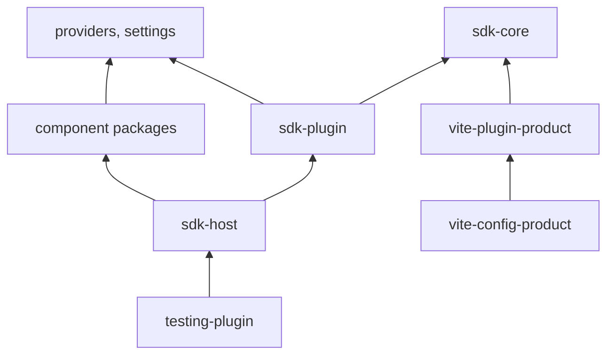

# RFC-0009: Plugins: an application composed from plugins

## Summary

We propose a plugin system that composes an application from plugins, built on the foundations and
components of this repository. A plugin is a contract package and a web package. The contract states
every name, type, path, condition, permission and flag a host needs without running plugin code, and
the web package maps each name to a lazy import. A product states which plugins it installs, how
each is configured, and when each is available.

Pages compile through `compileRoutes`, regions render in `AppShell`, commands list in `Command`,
settings render through `provider-form`, words resolve through `provider-i18n`, and data loads
through `provider-data` (RFC-0005). The first slice compiles plugins into the product as packages it
depends on. A Vite plugin checks and resolves the product at build, and the host builds the route
tree once, before the router exists. Loading a plugin at run time is a second slice with a proposal
of its own.

This RFC states the model, the packages, the parts and how they fit. RFC-0010 to RFC-0020 define
each part with its TypeScript contracts, its mechanisms and its failure handling.

## Motivation

### The requirements

- A plugin adds pages, contributions, commands, settings and its words without an edit to the
  product.
- A plugin links to another plugin's page, targets its slot, runs its command and checks its
  permission through references that plugin's contract exports. A call site takes a reference, never
  a path or a string name.
- A product's definition states which plugins it installs, how each one is configured, which ones a
  person may switch off, and under which condition each one is available.
- A person switches a plugin off and on, and an operator stops a plugin during an incident, while
  the page runs and without a reload.
- A page, a contribution, a command and a control appear only for a person who may use them: the
  person's permissions, for the tenant or on one resource, and the tenant's entitlements. The
  service behind each action enforces the same.
- Unreleased work is merged behind a flag with an end date, an experiment serves variants, and a
  product runs without a flag service.
- A plugin runs only the operations its contract declares, and a page's data loads with its code.
- A change one plugin makes to a record shows on the pages of other plugins that display the record.
- A plugin renders with this repository's components, so it looks and behaves like the rest of the
  product.
- The type checker, the plugin's tests and the product's build each check every declaration.
- The access service and the flag service receive every declaration from the build that deploys it.
- A plugin built for the first slice loads unchanged in the second.

### Why this layer

The plugin system depends on the component packages, because the host renders them. No foundation
depends on a component package, so the system cannot be a foundation. It gets a workspace group of
its own, `sdk/`.

Each part of a plugin renders with a piece this repository already has:

| A plugin's         | Renders with                                                                                              |
| ------------------ | --------------------------------------------------------------------------------------------------------- |
| Pages and links    | `provider-router`: `compileRoutes`, route references, `RouteLink`, and a failing condition as not found   |
| Frame and regions  | `component-screen`: `AppShell` with landmark regions, and `Page`                                          |
| Palette            | `component-modals`: `Command` over `CommandAction` objects, in a `Dialog`                                 |
| Keys               | `provider-hotkeys`                                                                                        |
| Words              | `vite-plugin-i18n` and `provider-i18n`, which find the catalogues of every package on the product's graph |
| A person's choices | `settings`: one store per product, which follows writes from other tabs                                   |
| Settings forms     | `provider-form`: a form built from a JSON Schema document                                                 |
| Toasts and dialogs | `component-feedback`'s `Toast` and `component-modals`' `createOverlay`                                    |

A plugin's data is the one part without a piece here yet. RFC-0005 proposes `provider-data`:
operations, the query client, invalidation by resource and route loaders. RFC-0020 builds the
plugin's data on it.

## Detailed design

### The proposals

| RFC                                            | Title                                                 | Defines                                                                                                 |
| ---------------------------------------------- | ----------------------------------------------------- | ------------------------------------------------------------------------------------------------------- |
| [0010](0010-plugin-contracts.md)               | Plugin contracts and manifests                        | Identifiers, references, every marker, `defineContract`, conditions, versions, `definePlugin`           |
| [0011](0011-composing-a-product.md)            | Composing a product from plugins at build             | `defineProduct`, the build plugin, `resolveProduct`, every check, the catalogues, chunks                |
| [0012](0012-plugin-host.md)                    | The plugin host: state, evaluation and failure        | `createHost`, the stores, availability, the route evaluator, quarantine, reports, server rendering      |
| [0013](0013-plugin-pages-and-contributions.md) | Plugin pages, the frame and contributions             | The route tree, not found, menus, the frame's regions, slots and keyed slots, `Into`, loading           |
| [0014](0014-plugin-access.md)                  | Plugin access: sessions, permissions and entitlements | Sessions, permissions on the tenant and on one resource, roles, entitlements, the access catalogue      |
| [0015](0015-plugin-feature-flags.md)           | Plugin feature flags                                  | Kinds, values, the flag source, kill switches, overrides, exposures, the flag catalogue, end dates      |
| [0016](0016-plugin-commands-and-events.md)     | Plugin commands, events and notifications             | The command registry, keys, the palette, the event bus, toasts, dialogs                                 |
| [0017](0017-plugin-settings.md)                | Plugin settings, switches and placements              | Settings pages and sections, switches, placements, storage, migration                                   |
| [0018](0018-plugin-words-and-styles.md)        | A plugin's words and styles                           | Catalogues, translation, one namespace per plugin, recipes                                              |
| [0019](0019-plugin-testing-and-tools.md)       | Testing plugins, and the tools of a plugin's author   | `checks()`, `renderPlugin`, `productChecks()`, the standalone host, the inspector, lint                 |
| [0020](0020-plugin-data.md)                    | Plugin data                                           | Queries and mutations in a contract, a page's data, decisions primed from data, the operation catalogue |

RFC-0005 proposes the data foundation that every application uses, with plugins or without.

### Terms

| Term         | Meaning                                                                                                   |
| ------------ | --------------------------------------------------------------------------------------------------------- |
| plugin       | A contract package and a web package, released together                                                   |
| contract     | The plugin's names, types, paths, conditions, access declarations and flags, as data. It imports no React |
| manifest     | The web package's map from each name the contract declares to a lazy import                               |
| product      | An application composed from plugins, stated with `defineProduct`                                         |
| host         | The stores, the evaluator and the React parts a product composes its application from                     |
| frame        | The product's component that renders `AppShell` and the regions                                           |
| slot         | A place that contributions go, declared by a contract and rendered by `Slot`                              |
| keyed slot   | A slot that renders only the extensions whose `match` equals the value it renders with                    |
| region       | A slot of the host's contract that a frame renders in an `AppShell` part                                  |
| extension    | A contribution to a slot, a route or another extension, declared by a contract                            |
| condition    | A `When` value the host evaluates over the session, the flags, the plugins and the matched routes         |
| availability | Whether a plugin is on: its kill switch, its switch, its condition and its requirements                   |
| config       | What a product states about a plugin at build, typed by the plugin's schema                               |
| session      | Who is signed in, for which tenant, with the permissions and entitlements the services granted            |
| permission   | What a person may do, granted for the tenant or on one resource of a declared kind                        |
| role         | A named set of one plugin's permissions, which the access service grants as one                           |
| entitlement  | A capability a tenant is licensed for                                                                     |
| flag         | A release flag, an experiment or an ops flag, valued per session by the product and a flag service        |
| kill switch  | The ops flag every installed plugin has, which stops the whole plugin                                     |
| override     | A flag value a developer or a tester sets in one tab                                                      |
| switch       | A person's choice to turn a whole plugin on or off                                                        |
| setting      | A person's value in a settings section a plugin declares                                                  |
| placement    | A person's or a product's move of an extension into a region, out of one, or in its order                 |
| operation    | A query, a mutation or a subscription the gateway runs, sent by its persisted id (RFC-0005)               |
| API version  | The version of `sdk-core`, which every manifest states as a caret range                                   |

### Packages

| Package                                   | Directory                      | Depends on                                                                                                                                                                                                                                                                                                                                                                                                                                               | Contains                                                                                                                                                                                                                                                        |
| ----------------------------------------- | ------------------------------ | -------------------------------------------------------------------------------------------------------------------------------------------------------------------------------------------------------------------------------------------------------------------------------------------------------------------------------------------------------------------------------------------------------------------------------------------------------- | --------------------------------------------------------------------------------------------------------------------------------------------------------------------------------------------------------------------------------------------------------------- |
| `@stealthscale/sdk-core`                  | `sdk/core`                     | Types of `@standard-schema/spec`                                                                                                                                                                                                                                                                                                                                                                                                                         | Contracts, markers, operations, conditions, versions, `definePlugin`, `defineProduct`, `resolveProduct`, the host contract, sessions, the catalogues' types                                                                                                     |
| `@stealthscale/sdk-plugin`                | `sdk/plugin`                   | `sdk-core`, `provider-router`, `provider-i18n`, `provider-data`, `provider-hotkeys`, `settings`, React as a peer                                                                                                                                                                                                                                                                                                                                         | `Slot`, `Into` and the hooks a plugin's components use                                                                                                                                                                                                          |
| `@stealthscale/sdk-host`                  | `sdk/host`                     | `sdk-core`, `sdk-plugin`, `provider-router`, `provider-i18n`, `provider-hotkeys`, `provider-form`, `provider-data`, `settings`, `hooks`, `component-actions`, `component-feedback`, `component-forms`, `component-layout`, `component-modals`, `component-navigation`, `component-screen`, `component-typography`, React and React DOM as peers, `@openfeature/web-sdk`, `provider-color-mode`, `provider-locale` and `provider-shell` as optional peers | `createHost`, `createHostRoutes`, `setupHostIntegration`, `HostProvider`, the host's parts, the palette, the settings pages, the OpenFeature adapter in `./openfeature`, the standalone product in `./standalone` and the standalone page in `./standalone/app` |
| `@stealthscale/vite-plugin-product`       | `packages/vite-plugin-product` | `@tanstack/hotkeys`, and `sdk-core`, `vite-plugin-base`, `vite-plugin-i18n` and `vite` as peers                                                                                                                                                                                                                                                                                                                                                          | The composition at build, `virtual:product`, the plugin chunks, the catalogues and a plugin's standalone page                                                                                                                                                   |
| `@stealthscale/vite-config-product`       | `packages/vite-config-product` | `vite-config`, `vite-config-theme` and `vite-plugin-product` as peers                                                                                                                                                                                                                                                                                                                                                                                    | The product layer, the standalone layer and the two lint layers                                                                                                                                                                                                 |
| `@stealthscale/testing-plugin`            | `packages/testing-plugin`      | `sdk-core`, and `sdk-host`, `sdk-plugin`, `provider-data`, `provider-form`, `provider-router`, `settings`, `testing-react`, Testing Library, React, `react-i18next` and `vitest` as peers                                                                                                                                                                                                                                                                | `checks()`, `renderPlugin`, `renderPluginHook`, `productChecks()`                                                                                                                                                                                               |
| `@stealthscale/plugin-inspector-contract` | `sdk/inspector/contract`       | `sdk-core`                                                                                                                                                                                                                                                                                                                                                                                                                                               | The inspector's contract                                                                                                                                                                                                                                        |
| `@stealthscale/plugin-inspector`          | `sdk/inspector/web`            | Its contract, `sdk-plugin`, component packages                                                                                                                                                                                                                                                                                                                                                                                                           | The inspector, a plugin like any other                                                                                                                                                                                                                          |

#### Invariants

- `sdk-core` does not depend on another package at run time, so a contract package, the build and a
  Node service load it without React.
- A plugin's components import `sdk-plugin` and never `sdk-host`. A lint layer reports the import
  (RFC-0019).
- A contract imports `sdk-core`, other contracts, its package manifest and a Standard Schema
  library. The lint refuses any other import (RFC-0019). A manifest entry does not import a
  component (RFC-0010).
- `sdk-plugin` defines every React context the SDK uses. In the second slice it is shared as one
  copy per page.
- The SDK packages release as one `linked` changesets group, so one version number applies to the
  whole API.
- No check the page makes is a security boundary. The services enforce every permission and
  entitlement (RFC-0014).
- A plugin runs only the operations its contract declares. The host's transport refuses every other,
  and the gateway runs only the documents the product published (RFC-0020).

### From a contract to a rendered page

1. An author declares a plugin's names in its contract and maps them to code in its manifest
   (RFC-0010). The plugin's spec runs the checks derived from both (RFC-0019).
2. A product installs plugins in its definition, with each plugin's configuration and condition
   (RFC-0011).
3. The build loads the definition, checks every plugin against the others, resolves every
   declaration, and writes `virtual:product`, the access catalogue, the flag catalogue and the
   operation catalogue. Each plugin builds into one chunk (RFC-0011).
4. The deployment sends the catalogues to the access service, the flag service and the gateway
   before the product goes live (RFC-0014, RFC-0015, RFC-0020).
5. When the page starts, the product builds the route tree once, creates the host and the router,
   and waits for `host.ready()` (RFC-0012).
6. A navigation runs the route evaluator in `beforeLoad`. The page's chunk, the chunks that
   contribute to its slots and the page's data load together, and each slot places its extensions
   (RFC-0013, RFC-0020).
7. A person runs commands through keys, the palette and buttons. Plugins announce facts on the event
   bus and raise toasts (RFC-0016).
8. A mutation settles, or the changes stream reports a change. The data client refetches the queries
   that show the changed records, and the host announces the change on the bus (RFC-0005, RFC-0020).
9. A session, a flag, a switch, a setting, a placement or a decision on a resource changes. The host
   updates one store, invalidates the router where a route condition reads the store, and renders
   the readers of the value that changed (RFC-0012, RFC-0014, RFC-0015, RFC-0017).
10. A page or an extension fails. The host contains the failure in the plugin, quarantines a target
    that keeps failing, and reports each entry (RFC-0012, RFC-0013).

### Access and flags

Access is checked at six layers (RFC-0014):

| Layer          | Checked with                                                        | Security boundary |
| -------------- | ------------------------------------------------------------------- | ----------------- |
| Plugin         | The product's condition on the plugin, typically an entitlement     | No                |
| Page           | The route's condition. A page a person may not open is not found    | No                |
| Contribution   | The extension's condition                                           | No                |
| Command        | The command's condition. A command a person may not run is disabled | No                |
| Part of a page | `usePermission`, `useAccess` for one resource, `useEntitlement`     | No                |
| Service        | The permission's qualified id, the resource and the entitlement     | Yes               |

- A permission is granted for the whole tenant, or on single resources of a kind the contract
  declares. A condition checks whether the session lists the permission at all, which is what a menu
  entry or a command needs. A control on one resource reads `useAccess`, which the host decides from
  a query's data (RFC-0020), or from the product's access source in one batch per task.
- A tenant's licence is a list of entitlements, checked like permissions and enforced by the
  services.
- A role is a named set of one plugin's permissions, which the access service grants. No condition
  checks a role.

Flags state what is released to a session (RFC-0015):

- A release flag hides merged work until it is released, an experiment serves one of its variants,
  and an ops flag turns a feature off during an incident. Every installed plugin has a kill switch.
- A value comes from an override, the flag source, the product or the contract, in that order.
- A release flag and an experiment state an end date. The build warns once the date has passed, and
  the plugin's own tests fail, so the flag is removed.

### The second slice

Loading a plugin at run time needs nine things. Each is stated with what establishes it:

1. One copy per page of every module that keeps state: React, ReactDOM, `sdk-plugin`, the provider
   packages and the libraries under them, `settings`, `hooks`, `@zag-js/dismissable` with its layer
   stack (`dist/layer-stack.mjs:4`) and `@zag-js/focus-visible` with its input modality
   (`dist/index.mjs:29`). The host provides each with `import: false`. `@module-federation/vite`
   1.21.5 builds such a share so that the remote cannot bundle a copy
   (`lib/index.js:786-797, 3574-3577`).
2. The API version, checked against a `contract.json` the remote serves, before the remote loads.
   The federation runtime only warns about a singleton outside a remote's range, and under
   `strictVersion` it throws inside the remote's import while the page renders
   (`@module-federation/runtime-core` 2.9.0, `dist/utils/share.js:188-193`).
3. A host stylesheet with every variant of each component package version the host supports. A
   product compiles only the variants its own graph uses (`apps/docs/theme.config.ts:9-12`), and a
   host cannot read a remote's source. The docs build compiles every variant for ten themes into
   2,922,146 bytes, 188,889 bytes gzipped.
4. A plugin's catalogues, fetched from its remote and added with `addResourceBundle`. The instance
   binds the `added` event, so a bundle added later renders its readers again
   (`foundations/providers/i18n/src/create-i18n.ts:151-154, 198`).
5. Releases without a change to the route tree, which TanStack Router does not support at run time.
   The host builds the tree once at start from every plugin's served contract, the way
   `examples/router-federated` reads a remote's declarations before it builds its router. A release
   that keeps its routes swaps the implementation behind route components the host defines. A
   release that adds or removes a route, and a plugin admitted after start, reload the document at
   the next navigation.
6. Build features `vite-config` lacks today: the federation runtime provided by the host, shares
   resolved `loaded-first`, `contract.json` beside each entry, Fast Refresh through the host's
   runtime, and the federation modules pre-bundled.
7. An exception to the bundle policy, because each shared specifier builds as a chunk of its own.
8. A choice between two component models. In one, the host provides the component packages as shared
   modules. In the other, each plugin bundles the components it renders and the host serves their
   stylesheet. The choice waits on a spike with a host that shares the modules in item 1 and one
   remote that bundles `component-actions` and `component-disclosure`. The spike counts chunks and
   bytes, and opens a plugin's menu over a host dialog.
9. A remote that loads only from an origin the product lists, with its entry's integrity checked,
   under a content security policy that lists those origins.

`resolveProduct` is the function the second slice's loader calls over served contracts (RFC-0011),
so both slices resolve a product the same way.

### Changes to existing packages

| Package               | Change                                                                                                                       | RFC  |
| --------------------- | ---------------------------------------------------------------------------------------------------------------------------- | ---- |
| `provider-router`     | `Evaluate` receives the route's context as its second argument                                                               | 0012 |
| `provider-router`     | `RouteDeclaration` takes `loader`, which the compiler passes to the route with the search as its dependencies                | 0005 |
| `provider-router`     | `RouteRef` types the search. `useRouteSearch` reads it. `RouteLink` takes `search`. `SearchValidator` states its output type | 0013 |
| `component-screen`    | `AppShell.Status`, a bar at the foot of the shell                                                                            | 0013 |
| `vite-config`         | `sdk` joins the workspace directories the chunk rules match (`packages/vite-config/src/build/chunks.ts:25-33`)               | 0011 |
| `pnpm-workspace.yaml` | `sdk/*` and `sdk/inspector/*` join the workspace                                                                             | 0009 |

### Delivery

1. Make the changes to `provider-router` and `component-screen` listed in the preceding table.
2. Create `foundations/providers/data` with its `./router` and `./testing` entries (RFC-0005).
3. Create `sdk/core`: identifiers, markers, references, operations, conditions, versions,
   `definePlugin`, `defineProduct`, `resolveProduct`, the host contract, sessions and the
   catalogues' types. The `sdk/*` glob joins the workspace and `sdk` joins the chunk patterns in the
   same step, because a glob and a path pattern need a directory to match.
4. Create `sdk/plugin` with the hooks and components that plugin code imports.
5. Create `sdk/host` with the stores, the evaluator, the host's parts, the palette, the settings
   pages and the OpenFeature adapter.
6. Create `packages/vite-plugin-product`, and `packages/vite-config-product` with the product layer
   and the two lint layers.
7. Create `packages/testing-plugin` on `testing-react`, and the standalone layer of
   `vite-config-product`. Both render one plugin under a host over a product built from its
   contract, its manifest and the contracts beside it. One builder serves both: `standaloneProduct`
   in `@stealthscale/sdk-host/standalone`.
8. Create the inspector plugin in `sdk/inspector`, and add the `sdk/inspector/*` glob to the
   workspace.
9. Add `examples/app-plugins`, a product of three plugins that the gate builds, with a frame, a
   permission on one resource, an entitlement, a release flag, an experiment, a command with a
   result, a page whose data loads with its route, and a mutation that changes a record another page
   displays. Measure its chunks, its entry chunk's size, its requests with and without the preloads,
   its re-renders per change, and the time the type checker and the build take with the plugins'
   contracts. Add the scaffold, `pnpm plugin:create`, which writes a plugin package like these
   (RFC-0019).

## Alternatives considered

### A plugin system with its own router, layout and palette

The SDK has a route matcher, a page layout and a palette of its own.

**Why not:** a product would run the SDK's routing rules beside `provider-router`'s, and a plugin
would render in elements the design system does not style. Every piece this system renders has a
counterpart here, with its tests, its recipe and its accessibility checks.

### Put the SDK in `foundations/`

**Why not:** the host renders component packages, and a foundation cannot depend on a package above
it.

### Load plugins at run time first

**Why not:** the first slice uses only what this repository already has. Loading at run time needs
the nine things in "The second slice", and two of them wait on a spike.

### One proposal for the whole system

**Why not:** the system has eleven parts with their own contracts and failure modes. A reviewer
decides each part on its own, and one proposal per part keeps each decision reviewable.

## Drawbacks

- A new workspace group, eight packages and one plugin of the SDK's own, released together.
- A plugin is two packages, and its web package depends on the component packages it renders.
- A product's build loads every contract and every manifest entry in Node, so a contract that
  imports anything beyond its allowed imports breaks the build.
- On a development server a change to a contract reloads the page, because the route tree is built
  once per router.
- In the second slice, a release that adds or removes a route reloads the page, and a release of any
  shared package is a release for every remote. Every package here is 0.x, and a caret range over a
  0.x version does not admit a new minor.

## Unresolved and future work

- The second slice, in a proposal of its own after the spike.
- A route tree that changes at run time, if TanStack Router comes to support one.
- Extension points that contribute data rather than components, such as providers of search results.
- Configuration read when the page starts, so one build serves more than one environment.
- A frame that a plugin contributes.
- A sandbox for a plugin the product does not trust.

## References

| What                                                 | Where                                                                  |
| ---------------------------------------------------- | ---------------------------------------------------------------------- |
| Routing: the pieces a router is built from           | `docs/rfc/0006-routing.md`                                             |
| The data foundation                                  | `docs/rfc/0005-data.md`                                                |
| Forms built from a schema                            | `docs/rfc/0007-forms.md`                                               |
| Refusing a failing condition as not found            | `docs/adr/0024-refuse-a-failing-condition-as-not-found.md`             |
| Rendering one page per matched route                 | `docs/adr/0025-draw-one-page-per-matched-route.md`                     |
| A route tree that changes at run time is unsupported | https://github.com/TanStack/router/issues/8571#issuecomment-5908577875 |
| The federation plugin this repository installs       | https://www.npmjs.com/package/@module-federation/vite/v/1.21.5         |
| The router this repository installs                  | https://www.npmjs.com/package/@tanstack/react-router/v/1.170.34        |
